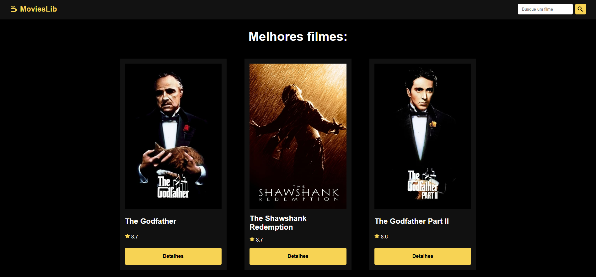
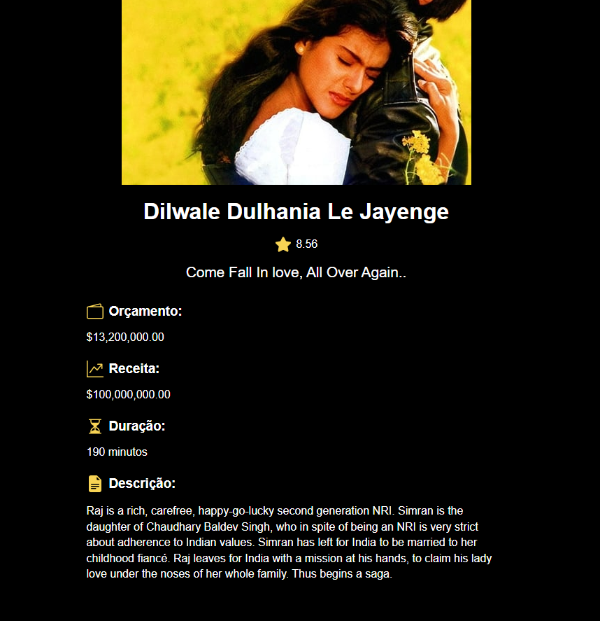

# MoviesLib - Catálogo de filmes com React

O projeto consiste em um catálogo de filmes consumindo a API do TMDB de filmes.
No projeto existe a página home onde lista os filmes mais top de acordo com a API do TMDB, e também tem a página de detalhes do filme selecionado conforme a imagem de layout. E por fim, o projeto tem a funcionalidade de filtrar os filmes pelo nome que você buscar.


## Layout

|Página Home|Detalhes do filme selecionado|
|---|---|
| | 

## 🚀 Começando

Pra começar, primeiro clone o repositório do projeto pra sua máquina

```
$ git clone https://github.com/Vinicius-Rubia/MoviesLib-API-TMDB.git
```

## ⚙️ Executando a aplicação

Para iniciar a aplicação, execute em seu terminal:

```
$ npm install -> Instalar todas as dependências
```

```
$ npm run dev -> Inicia a aplicação em localhost
```

Para aprender a como utilizar a API do TMDB utlizada, acesse https://developers.themoviedb.org/3/getting-started/introduction